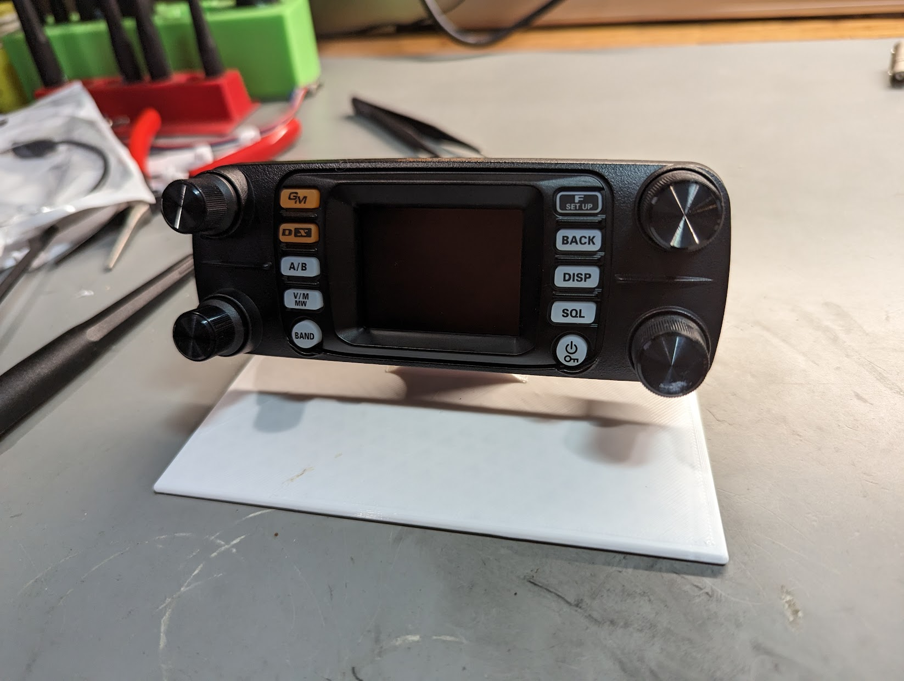
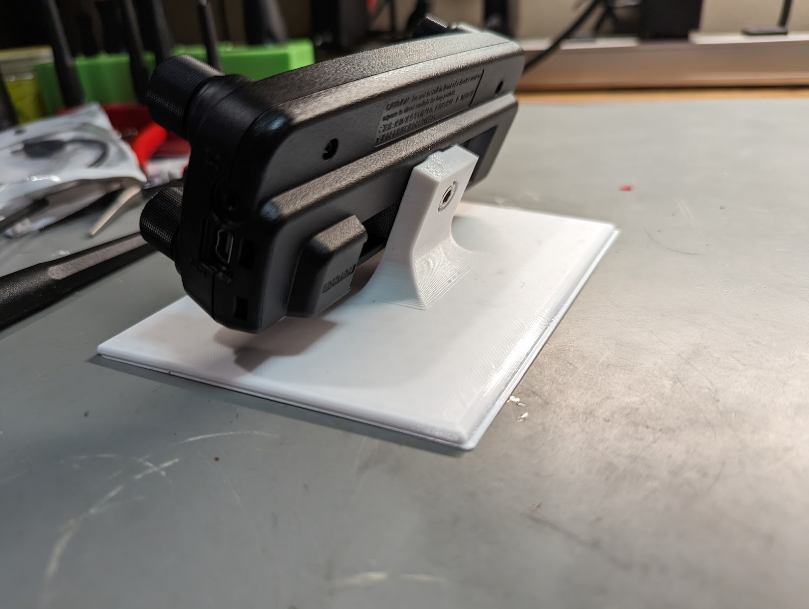
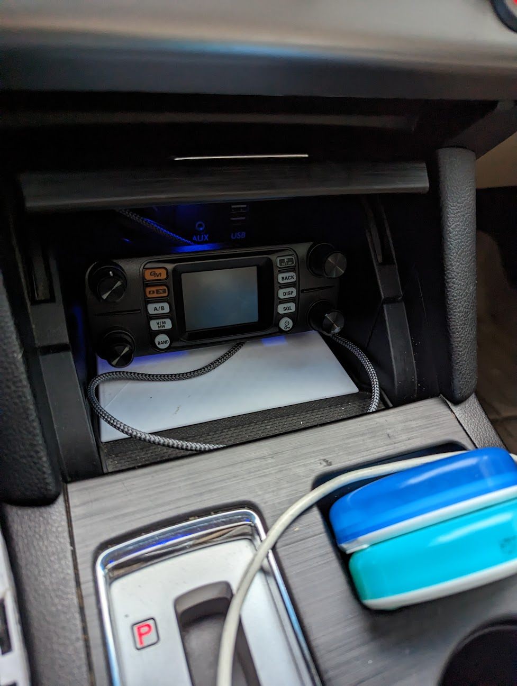

# Yaesu FTM-300DR Head unit mount for 5th Gen (2015-2017) Subaru Outback center console

Designed this to try to cleanly mount my Yaesu FTM-300DR head unit in the console of my 2015 Subaru Outback

Be sure to print in PETG to be more temperature tolerant

# Changelog
2022-12-13 - Initial Commit

## Design

Autocad Fusion 360 

## Slicer

Ultimaker Cura 4.12.1

- Printer: Creality CR6 SE

- Layer Height: 0.2mm
- Infill Density: 20%
- Infill Pattern: Grid

- Filament: Inland PETG+ 1.75mm White
- Material: PETG+
- Print Temperature: 235 degrees C

## Preview

